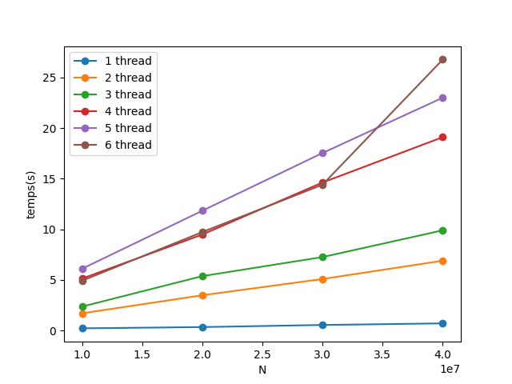

# TD2C

***Compilation*** 

Dans le dossier build : g++ ../projetROB305/TD2c/*.cpp -lrt -lpthread 

***Exécution***  
Dans le dossier build : ./a.out \<valeur finale du compteur (int)> \<nombre de thread> \<stratégie ordonnancement>

***Rendu des TDs***

    On va mesurer changer la stratégie d'ordonnancement en rajoutant un paramètre permettant de la choisir. On trace des courbes d'exécution pour la stratégie SCHED_RR

    Au vu des résultats et de ce qui se passe pour un nombre de thread supérieur à 4, on affirme que la machine sur laquelle on travail à 4 coeurs ce qui est confirmé avec la commande lscpu. 
    

    
   

